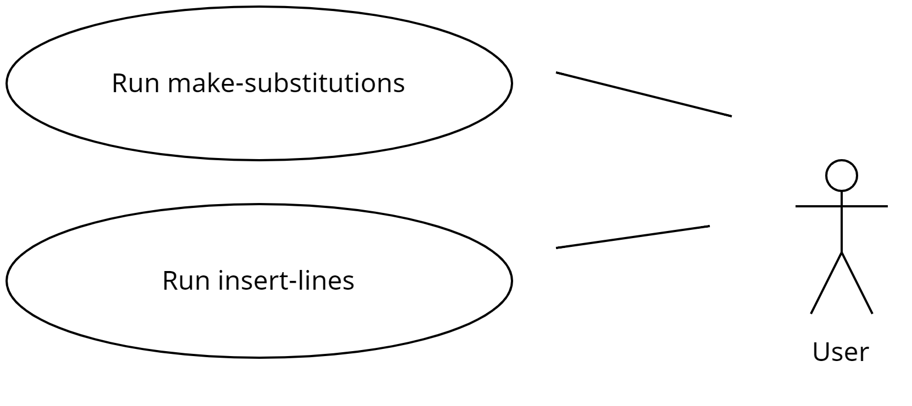
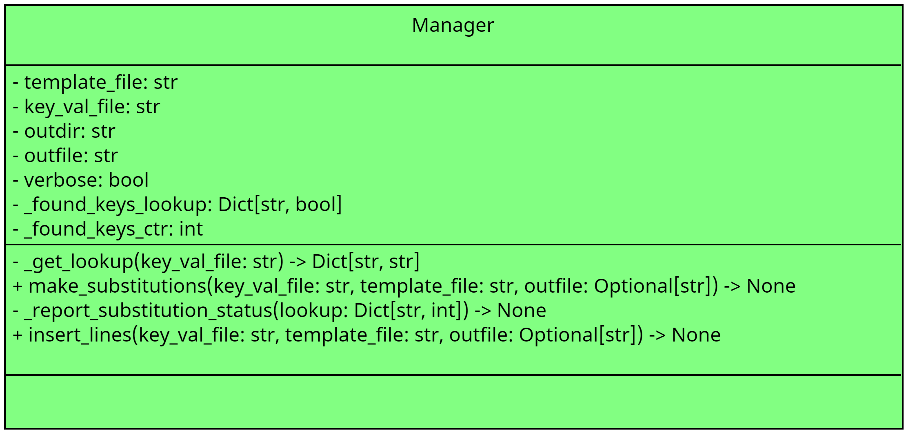

# simple-template-toolkit

Simple templating for all your simple templating projects

- [simple-template-toolkit](#simple-template-toolkit)
  - [Improvements](#improvements)
  - [Use Cases](#use-cases)
  - [Class Diagrams](#class-diagrams)
  - [Installation](#installation)
  - [Usage](#usage)
  - [Exported scripts](#exported-scripts)
  - [Contributing](#contributing)
  - [To-Do/Coming Next](#to-docoming-next)
  - [CHANGELOG](#changelog)
  - [License](#license)


## Improvements

Please see the [TODO](docs/TODO.md) for a list of upcoming improvements.


## Use Cases




## Class Diagrams



## Installation

Please see the [INSTALL](docs/INSTALL.md) guide for instructions.

## Usage


```python
from simple_template_toolkit import STTManager

tm = STTManager()

tm.make_substitutions(
  template_file=template_file,  # the template file containing your placeholder keys (e.g.: $;PARAM1$;)
  outfile=outfile, # the file that should be written out
  lookup=lookup # a dictionary contain placeholders for keys (e.g.: $;PARAM1$;) and corresponding values (e.g.: xyz) replace with
)
```

## Exported scripts

The following exported console script is available for use:

- make-substitutions
- insert-lines

## Contributing

Pull requests are welcome. For major changes, please open an issue first
to discuss what you would like to change.

## To-Do/Coming Next

Please view the listing of planned improvements [here](docs/TODO.md).

## CHANGELOG

Please view the CHANGELOG [here](docs/CHANGELOG.md).

## License

[GNU AFFERO GENERAL PUBLIC LICENSE](docs/LICENSE)
